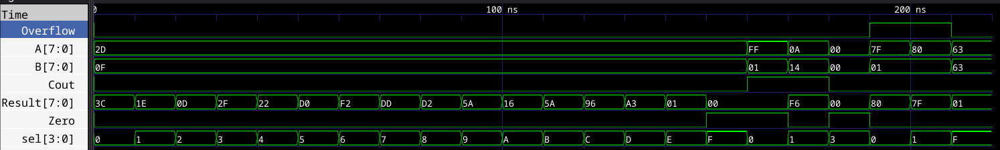

# 8-Bit Arithmetic Logic Unit (ALU) in Verilog HDL

**Name:** Kushal Shrestha
**Roll No:** 079BCT043
**Assignment:** FPGA Lab Assignment

---

This repository contains a design and simulation of an 8-bit Arithmetic Logic Unit (ALU) implemented in Verilog HDL using **dataflow modeling**. The ALU performs 16 different operations selected by a 4-bit operation selector (`sel`).

## ALU Architecture

### Ports Interface

| Port Name  | Direction | Width  | Description                          |
| :--------- | :-------- | :----- | :------------------------------------ |
| `A`        | Input     | 8 bits | Operand A                             |
| `B`        | Input     | 8 bits | Operand B                             |
| `sel`      | Input     | 4 bits | Operation selector                    |
| `Result`   | Output    | 8 bits | ALU result                            |
| `Cout`     | Output    | 1 bit  | Carry out (addition) / Borrow out (subtraction) |
| `Zero`     | Output    | 1 bit  | Zero flag (1 if `Result` is 0)        |
| `Overflow` | Output    | 1 bit  | Signed overflow flag (addition/subtraction) |

### Operation Mapping (`sel`)

| `sel`   | Operation | Description                          |
| :-----: | :-------: | :------------------------------------ |
| `4'b0000` | **ADD**  | Addition (`Result = A + B`)          |
| `4'b0001` | **SUB**  | Subtraction (`Result = A - B`)       |
| `4'b0010` | **AND**  | Bitwise AND (`Result = A & B`)       |
| `4'b0011` | **OR**   | Bitwise OR (`Result = A | B`)        |
| `4'b0100` | **XOR**  | Bitwise XOR (`Result = A ^ B`)       |
| `4'b0101` | **NOR**  | Bitwise NOR (`Result = ~(A | B)`)    |
| `4'b0110` | **NAND** | Bitwise NAND (`Result = ~(A & B)`)   |
| `4'b0111` | **XNOR** | Bitwise XNOR (`Result = ~(A ^ B)`)   |
| `4'b1000` | **NOT**  | Bitwise NOT of A (`Result = ~A`)     |
| `4'b1001` | **SLL**  | Shift Left Logical by 1 (`Result = A << 1`) |
| `4'b1010` | **SRL**  | Shift Right Logical by 1 (`Result = A >> 1`) |
| `4'b1011` | **ROL**  | Rotate Left by 1                     |
| `4'b1100` | **ROR**  | Rotate Right by 1                    |
| `4'b1101` | **MUL**  | Multiplication, lower 8 bits (`Result = A * B`) |
| `4'b1110` | **GT**   | Greater Than (`Result = (A > B)`)    |
| `4'b1111` | **EQ**   | Equal To (`Result = (A == B)`)       |

---

## Design Style: Dataflow Modeling

Unlike a behavioral design (which uses an `always` block with a `case` statement), this ALU is written using **continuous assignments** (`assign`). Every operation is computed in parallel on its own wire, and a ternary-operator chain acts as a multiplexer that selects the final output based on `sel`. This style maps more directly to how the underlying hardware logic actually flows.

---

## How to Run

To run the simulation, make sure you have [Icarus Verilog](http://iverilog.icarus.com/) and [vvp](https://linux.die.net/man/1/vvp) installed.

### 1. Compile the Design and Testbench

```bash
iverilog -o alu_test alu.v alu_tb_simple.v
```

### 2. Run the Simulation

```bash
vvp alu_test
```

Running the simulation will output verification logs for all ALU operations, including edge cases for carry, borrow, zero, and signed overflow.

### 3. View Waveforms

If you'd like to inspect signal transitions visually, add `$dumpfile` and `$dumpvars` calls to the testbench, then load the generated `.vcd` file into [GTKWave](https://gtkwave.github.io/gtkwave/).

---

## Simulation Waveform

Below is the waveform showing the simulation results for the test vectors:


