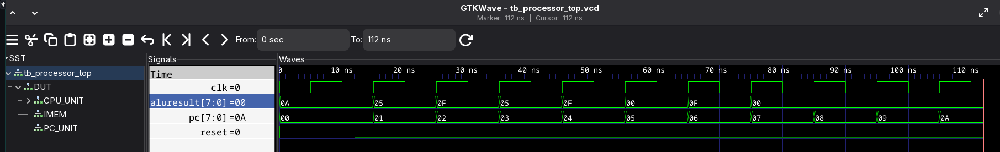

# Assignment 2: Control Unit Implementation for 8-bit Processor
Name: Kushal Shrestha
Roll: 079BCT043

This project implements a simple 8-bit processor based on the given CPU architecture diagram. The processor is built step by step using Verilog modules for the control unit, register file, ALU, multiplexers, two's complement logic, program counter, instruction memory, and top-level processor connection.

The design was compiled and simulated using **Icarus Verilog** and viewed using **GTKWave**.

---

## 1. Project Goal

The goal of this assignment is to implement the **control unit for an 8-bit processor** and connect it with the remaining datapath components shown in the architecture.

The processor supports:

- 8-bit data width
- 8 general-purpose registers
- 32-bit instruction format
- Arithmetic operations
- Logical operations
- Immediate loading
- Register-to-register movement
- Program counter based instruction fetching
- Instruction memory based execution

---

## 2. CPU Architecture Overview

The processor follows this basic datapath:

```text
Instruction Memory -> Control Unit -> Register File -> MUX -> ALU -> Register File
                     ^
                     |
               Program Counter
```

The main blocks are:

1. **Program Counter**  
   Provides the address of the current instruction.

2. **Instruction Memory**  
   Stores a small program and outputs one 32-bit instruction based on the PC value.

3. **Control Unit**  
   Decodes the instruction and generates control signals.

4. **Register File**  
   Contains eight 8-bit registers, `R0` to `R7`.

5. **Two's Complement Block**  
   Generates the negative value of `REGOUT2`, used for subtraction.

6. **MUX Blocks**  
   Select between normal register value, two's complement value, and immediate value.

7. **ALU**  
   Performs arithmetic and logical operations.

---

## 3. Files in the Project

```text
alu.v
control_unit.v
mux2_8bit.v
twos_complement.v
register_file.v
cpu.v
program_counter.v
instruction_memory.v
processor_top.v
tb_processor_top.v
screenshot.png
```

### File Description

| File | Purpose |
|---|---|
| `control_unit.v` | Decodes the 32-bit instruction and generates register addresses, ALU operation, write enable, and MUX select signals. |
| `alu.v` | Performs arithmetic and logical operations. |
| `mux2_8bit.v` | 2-input, 8-bit multiplexer used in the datapath. |
| `twos_complement.v` | Converts an 8-bit input into its two's complement value. |
| `register_file.v` | Implements 8 registers, each 8-bit wide. |
| `cpu.v` | Connects the control unit, register file, ALU, MUXes, and two's complement block. |
| `program_counter.v` | Generates the current instruction address. |
| `instruction_memory.v` | Stores the sample program instructions. |
| `processor_top.v` | Top-level module connecting PC, instruction memory, and CPU. |
| `tb_processor_top.v` | Testbench used to simulate the processor. |
| `screenshot.png` | GTKWave screenshot showing simulation output. |

---

## 4. Instruction Format

The processor uses a 32-bit instruction.

```text
[31:24]  Opcode
[23:19]  Unused
[18:16]  Write Register
[15:11]  Unused
[10:8]   Read Register 1
[7:3]    Unused / immediate bits depending on instruction
[2:0]    Read Register 2
```

For immediate instructions such as `LOADI`, the lower 8 bits are used as the immediate value:

```text
[31:24]  Opcode
[18:16]  Write Register
[7:0]    Immediate value
```

For register instructions such as `ADD`, `SUB`, `AND`, and `OR`, the fields are interpreted as:

```text
WRITEREG = Destination register
READREG1 = First source register
READREG2 = Second source register
```

---

## 5. Supported Instructions

| Instruction | Opcode | Operation |
|---|---:|---|
| `LOADI` | `00000000` | Load immediate value into register |
| `MOV` | `00000001` | Copy value from one register to another |
| `ADD` | `00000010` | Add two register values |
| `SUB` | `00000011` | Subtract second register from first register |
| `AND` | `00000100` | Bitwise AND |
| `OR` | `00000101` | Bitwise OR |
| `XOR` | `00000110` | Bitwise XOR |
| `SLL` | `00000111` | Logical left shift |
| `SRL` | `00001000` | Logical right shift |
| `NOP` | `11111111` | No operation |

---

## 6. Control Unit Implementation

The control unit takes a 32-bit instruction and extracts:

```text
readreg1
readreg2
writereg
immediate
aluop
writeenable
mux_reg2_select
mux_imm_select
```

The control unit uses the opcode to decide how the datapath should behave.

For example, for `LOADI`:

```text
writeenable     = 1
aluop           = ALU_FORWARD
mux_imm_select  = 1
mux_reg2_select = 0
```

This means the immediate value is selected and forwarded through the ALU into the destination register.

For `SUB`, the design uses the two's complement path:

```text
mux_reg2_select = 1
aluop           = ALU_ADD
```

So subtraction is performed as:

```text
REGOUT1 - REGOUT2 = REGOUT1 + two's_complement(REGOUT2)
```

---

## 7. Register File

The register file contains eight 8-bit registers:

```text
R0, R1, R2, R3, R4, R5, R6, R7
```

It has:

- Two asynchronous read ports
- One synchronous write port
- Reset support

On reset, all registers are cleared to `0`.

---

## 8. ALU

The ALU receives two 8-bit operands and a 3-bit ALU operation signal.

Supported ALU operations:

```text
ALU_FORWARD
ALU_ADD
ALU_SUB
ALU_AND
ALU_OR
ALU_XOR
ALU_SLL
ALU_SRL
```

In the current datapath, `SUB` from the instruction set is performed using `ALU_ADD` with the two's complement of `REGOUT2`.

---

## 9. Program Counter

The program counter is an 8-bit register.

On reset:

```text
PC = 0
```

On every positive clock edge:

```text
PC = PC + 1
```

This allows the processor to fetch instructions sequentially from instruction memory.

---

## 10. Instruction Memory Program

The instruction memory contains this sample program:

```text
LOADI R1, 10
LOADI R2, 5
ADD   R3, R1, R2
SUB   R4, R1, R2
MOV   R5, R3
AND   R6, R1, R2
OR    R7, R1, R2
NOP
```

Expected final register values:

```text
R0 = 0
R1 = 10
R2 = 5
R3 = 15
R4 = 5
R5 = 15
R6 = 0
R7 = 15
```

---

## 11. Instruction Encoding Used in Simulation

| PC | Instruction | Encoded Hex | Meaning |
|---:|---|---|---|
| 0 | `LOADI R1, 10` | `0001000A` | Load 10 into R1 |
| 1 | `LOADI R2, 5` | `00020005` | Load 5 into R2 |
| 2 | `ADD R3, R1, R2` | `02030102` | R3 = R1 + R2 |
| 3 | `SUB R4, R1, R2` | `03040102` | R4 = R1 - R2 |
| 4 | `MOV R5, R3` | `01050003` | R5 = R3 |
| 5 | `AND R6, R1, R2` | `04060102` | R6 = R1 & R2 |
| 6 | `OR R7, R1, R2` | `05070102` | R7 = R1 \| R2 |
| 7+ | `NOP` | `FF000000` | No operation |

---

## 12. Simulation Output

The waveform shows that the program counter increments correctly and the ALU result changes according to the currently executed instruction.

Observed ALU result sequence:

```text
0A -> 10   result of LOADI R1, 10
05 -> 5    result of LOADI R2, 5
0F -> 15   result of ADD R3, R1, R2
05 -> 5    result of SUB R4, R1, R2
0F -> 15   result of MOV R5, R3
00 -> 0    result of AND R6, R1, R2
0F -> 15   result of OR R7, R1, R2
00 -> 0    result after program ends / NOP behavior
```

The waveform screenshot is included below:



---

## 13. Reset Behavior

In the testbench, reset is initially high:

```verilog
reset = 1'b1;
```

After 12 ns, reset is deasserted:

```verilog
#12;
reset = 1'b0;
```

Therefore, at the beginning of the waveform, reset is `1`. After the processor starts running, reset becomes `0`. In GTKWave, the value displayed in the signal list depends on the current cursor position.

---

## 14. Compile Instructions

To compile the full processor testbench:

```bash
iverilog -o tb_processor_top.out \
  tb_processor_top.v \
  processor_top.v \
  program_counter.v \
  instruction_memory.v \
  cpu.v \
  control_unit.v \
  register_file.v \
  alu.v \
  mux2_8bit.v \
  twos_complement.v
```

---

## 15. Run Simulation

Run the compiled simulation:

```bash
vvp tb_processor_top.out
```

This generates the waveform file:

```text
tb_processor_top.vcd
```

---

## 16. View Waveform in GTKWave

Open the waveform:

```bash
gtkwave tb_processor_top.vcd
```

Useful signals to observe:

```text
clk
reset
pc
instruction
aluresult
```

For deeper debugging, expand:

```text
tb_processor_top -> DUT -> CPU_UNIT
```

and observe:

```text
readreg1
readreg2
writereg
writeenable
regout1
regout2
operand1
operand2
aluop
```

---

## 17. Final Result

The implementation successfully executes the sample program.

Final expected register state:

```text
R0 = 0
R1 = 10
R2 = 5
R3 = 15
R4 = 5
R5 = 15
R6 = 0
R7 = 15
```

The waveform confirms that the ALU outputs match the expected results for `LOADI`, `ADD`, `SUB`, `MOV`, `AND`, and `OR` instructions.

---

## 18. Conclusion

This project implements a working basic 8-bit processor datapath with a functional control unit. The control unit correctly decodes 32-bit instructions and drives the datapath using ALU operation signals, register addresses, write enable, and MUX select signals.

The processor can fetch instructions from instruction memory using a program counter and execute a small program successfully. The simulation output verifies that the control unit and datapath are working as expected.
