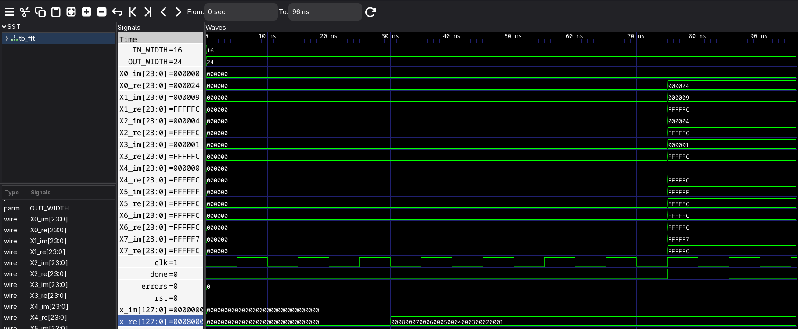

# Assignment 3 - Implement FFT in Verilog, Simulate and Verify It

## Kushal Shrestha
### Roll No: 079BCT043

This project implements a simple **8-point radix-2 Decimation-In-Time (DIT) FFT** in Verilog. The FFT uses three butterfly stages and fixed-point arithmetic for the `0.7071` twiddle factor.

The testbench applies the real input sequence:

`x[n] = {1, 2, 3, 4, 5, 6, 7, 8}`

and automatically checks the FFT output. The small difference from exact decimal FFT values is due to fixed-point integer truncation.

## Files

- `fft.v` - 8-point FFT module
- `tb_fft.v` - testbench and verification
- `run.sh` - compiles and runs the simulation
- `fft.vcd` - generated waveform after running the script
- `screenshot.png` - simulation/waveform screenshot to be added

## Compile and Run

Icarus Verilog is required.

```bash
chmod +x run.sh
./run.sh
```

The script compiles the Verilog files, runs the testbench, and generates:

```text
fft.vcd
```

To view the waveform using GTKWave:

```bash
gtkwave fft.vcd
```

## Simulation Screenshot



