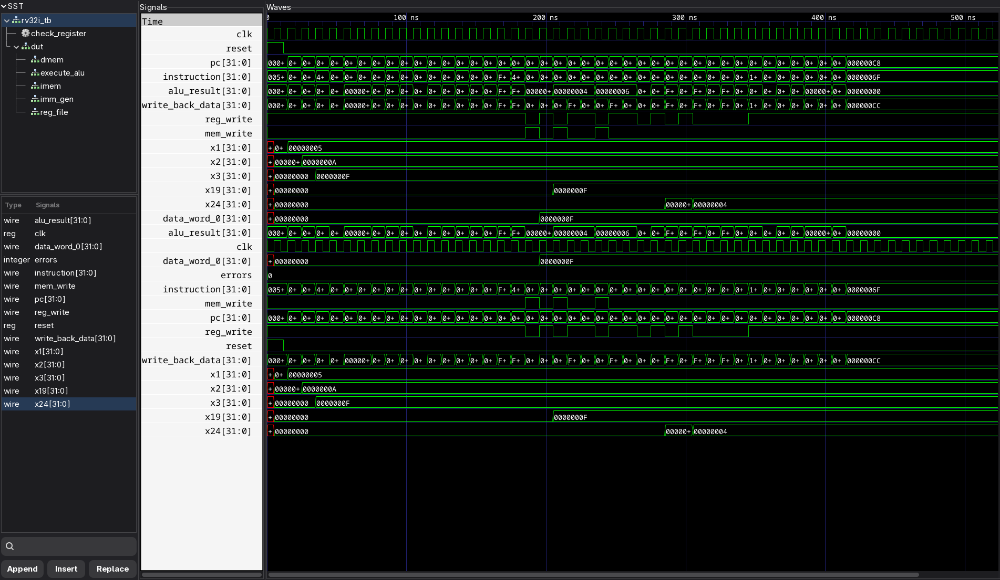

# Single-Cycle RV32I CPU

**Name:** Kushal Shrestha  
**Roll Number:** 079BCT043

This assignment implements a 32-bit single-cycle RISC-V processor in Verilog. It supports RV32I arithmetic and logical instructions, loads and stores, conditional branches, `LUI`, `AUIPC`, `JAL`, and `JALR`.

## Run

Icarus Verilog and GTKWave are required.

```bash
chmod +x run.sh
./run.sh
gtkwave wave.vcd wave.gtkw
```

The testbench checks the register and memory results automatically. A successful run prints:

```text
PASS: all RV32I CPU checks completed successfully.
```

## Output



The GTKWave output shows the clock-driven execution of the test program from 0 ns to 586 ns. The program counter and instruction signals change as each instruction is executed, while `reg_write` and `mem_write` show register-file and data-memory updates. The final waveform confirms `x1 = 5`, `x2 = 10`, `x3 = 15`, `x19 = 15`, `x24 = 4`, and data-memory word 0 equals 15. The `errors` signal remains 0, indicating that all automated checks passed. At the end, the processor stays at address `0x000000C8` on the `jal x0, 0` halt loop.
